# CodePlay - Gamified Coding Platform

A modern, interactive coding game portal that gamifies programming practice, learning, and competition. Built with React, Node.js, and MongoDB.

## 🌐 Live Preview (Temporary DevTunnel Link)

> 🧪 For testing purposes (only works while tunnel is active):
[https://ncb3w600-5174.inc1.devtunnels.ms/](https://ncb3w600-5174.inc1.devtunnels.ms/)

Note: This is a temporary tunnel URL and may expire when the developer is offline.

## 🎮 Features

### Core Functionality
- **Interactive Code Editor**: Monaco Editor with syntax highlighting for multiple languages
- **Real-time Code Execution**: Integrated with Piston API for secure code execution
- **Gamified Learning**: XP system, levels, badges, and streaks
- **Multiple Game Modes**: MCQ quizzes, flash cards, battle arena, and more
- **Problem Library**: Curated coding problems with varying difficulties
- **Real-time Competitions**: 1v1 coding battles with live updates
- **Google Authentication**: Secure OAuth integration with Google Sign-In

### Game Modes
- **MCQ Quiz**: Quick programming concept questions
- **Flash Cards**: Code output prediction challenges
- **Daily Practice**: Structured daily coding challenges
- **Battle Arena**: Real-time 1v1 coding competitions
- **Bug Hunter**: Find and fix bugs in code snippets
- **Data Structure Builder**: Visual data structure manipulation
- **Web Debugger**: Fix HTML/CSS/JS issues
- **SQL Mini-Games**: Interactive database challenges

### User Features
- **Profile System**: Track progress, badges, and achievements
- **Leaderboards**: Global and weekly rankings
- **Learning Resources**: Curated notes and interview questions
- **Premium Content**: Advanced features for premium users
- **Google Sign-In**: Quick authentication with Google accounts

### Admin Features
- **Problem Management**: CRUD operations for coding problems
- **User Management**: Monitor and manage user accounts
- **Analytics Dashboard**: Platform usage statistics
- **Content Moderation**: Review and approve user submissions

## 🚀 Tech Stack

### Frontend
- **React 18**: Modern React with hooks and context
- **TypeScript**: Type-safe development
- **Tailwind CSS**: Utility-first CSS framework
- **Framer Motion**: Smooth animations and transitions
- **Visual Studio Code Editor**:code editor
- **Zustand**: Lightweight state management
- **Socket.IO Client**: Real-time communication
- **Google Identity Services**: OAuth authentication

### Backend
- **Node.js**: Server-side JavaScript runtime
- **Express.js**: Web application framework
- **MongoDB**: NoSQL database with Mongoose ODM
- **JWT**: JSON Web Token authentication
- **Socket.IO**: Real-time bidirectional communication
- **Bcrypt**: Password hashing
- **Google Auth Library**: Server-side Google OAuth verification
- **Axios**: HTTP client for API requests

### External Services
- **Piston API**: Secure code execution service
- **MongoDB Atlas**: Cloud database hosting
- **Google OAuth**: Authentication service
## UI Screenshot

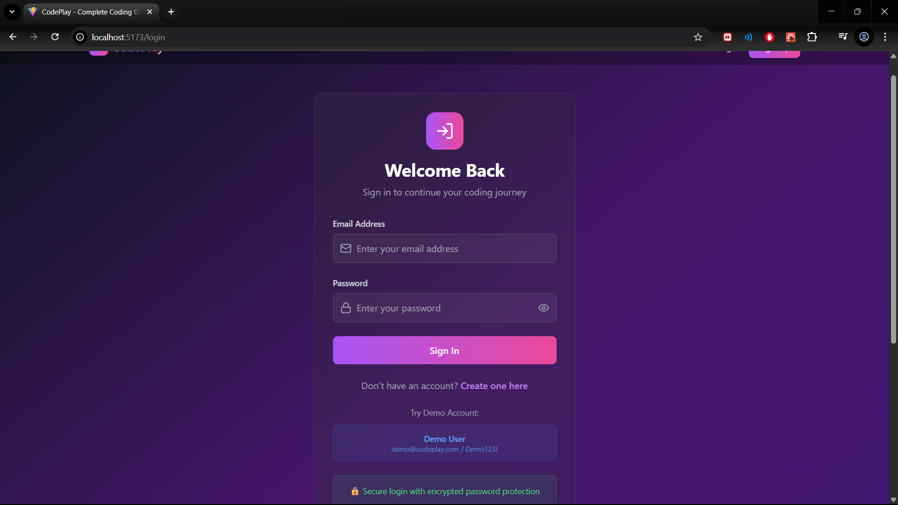

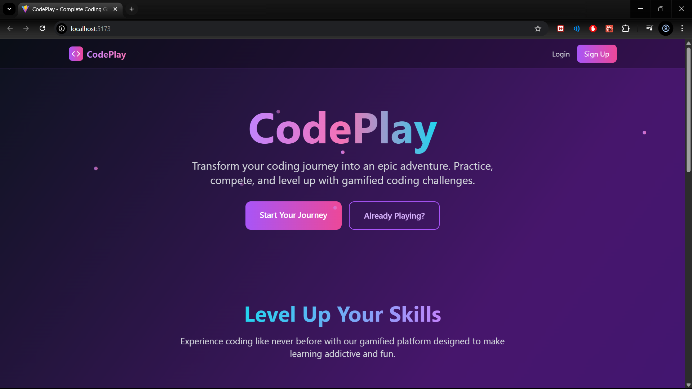

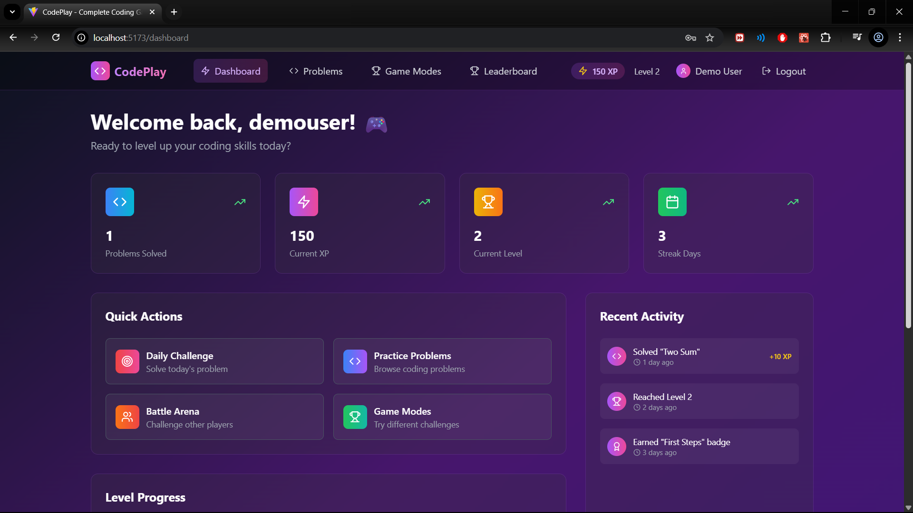

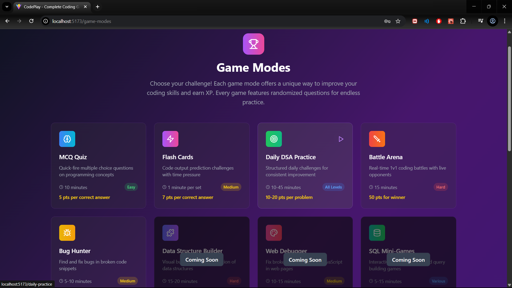

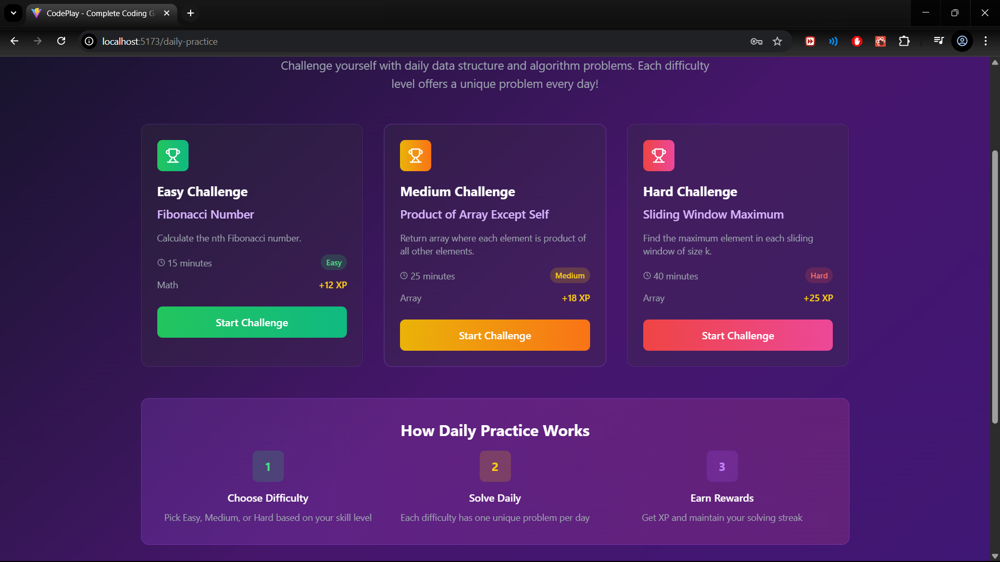

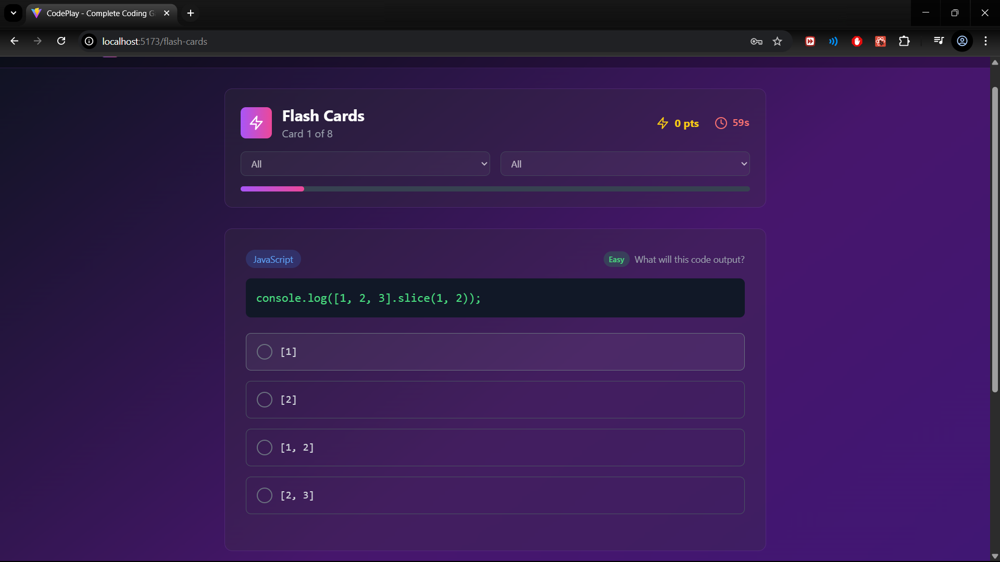

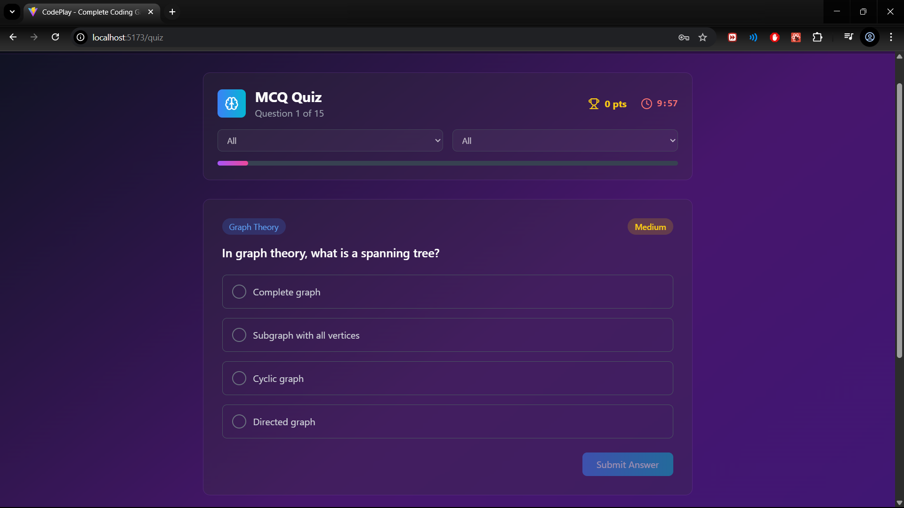

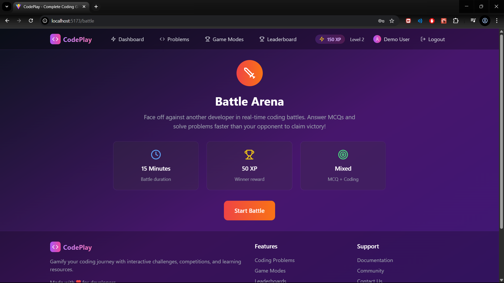

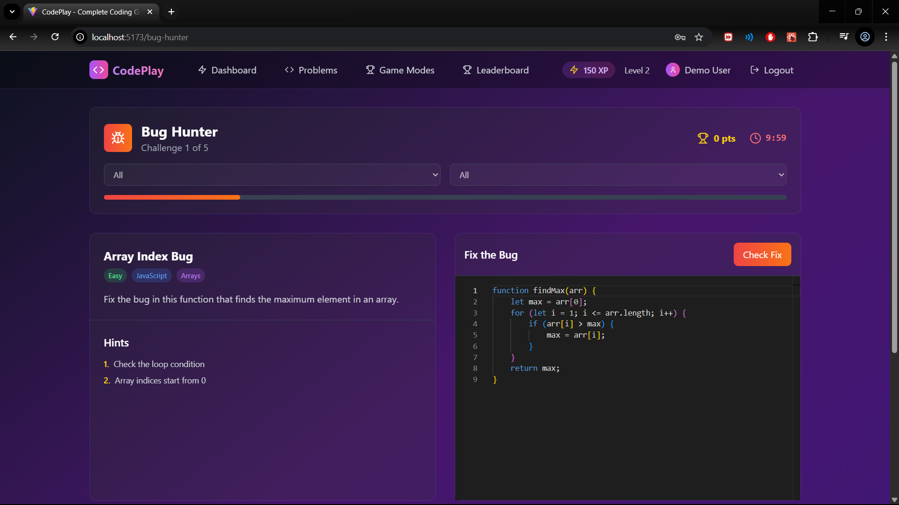

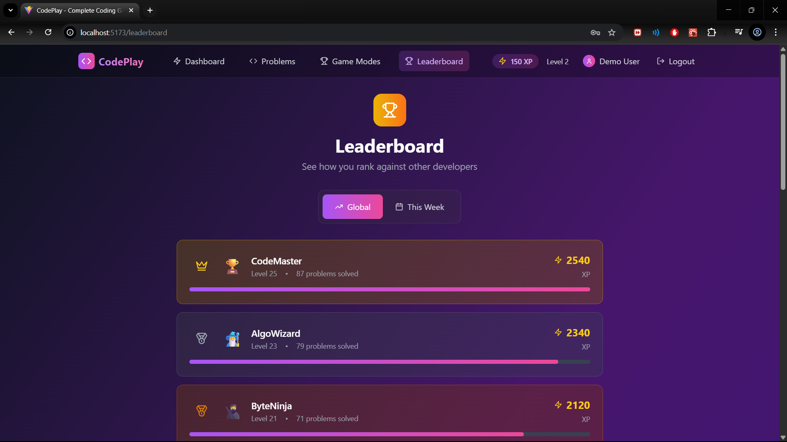

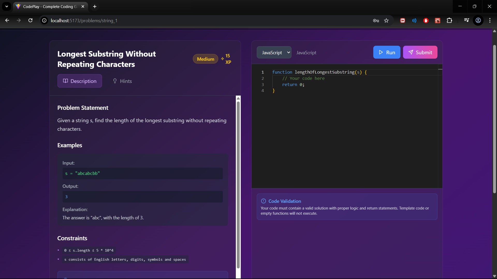

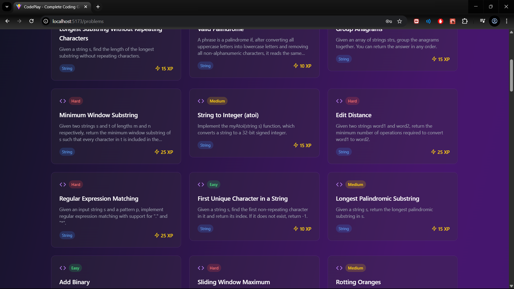

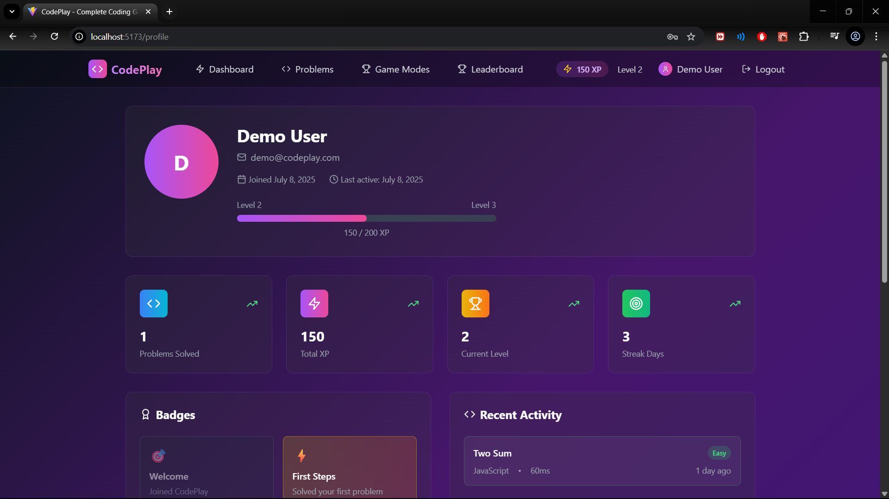

## 📦 Installation

### Prerequisites
- Node.js (v18 or higher)
- MongoDB (local or Atlas)
- Google OAuth credentials (for Google Sign-In)
- Git

### Setup Instructions

1. **Clone the repository**
   ```bash
   git clone <repository-url>
   cd codeplay
   ```

2. **Install dependencies**
   ```bash
   # Install frontend dependencies
   npm install
   
   # Install backend dependencies
   cd server
   npm install
   cd ..
   ```

3. **Google OAuth Setup**
   
   **Step 1: Create Google OAuth Credentials**
   - Go to [Google Cloud Console](https://console.cloud.google.com/)
   - Create a new project or select existing one
   - Enable Google+ API and Google Identity Services
   - Go to "Credentials" → "Create Credentials" → "OAuth 2.0 Client IDs"
   - Set application type to "Web application"
   - Add authorized origins:
     - `http://localhost:5173` (for development)
     - Your production domain
   - Add authorized redirect URIs:
     - `http://localhost:5173` (for development)
     - Your production domain
   - Copy the Client ID and Client Secret

   **Step 2: Configure Environment Variables**
   ```bash
   # Copy environment examples
   cp .env.example .env
   cp server/.env.example server/.env
   ```

   **Step 3: Update .env files**
   
   **Frontend (.env):**
   ```env
   VITE_GOOGLE_CLIENT_ID=your-google-client-id.apps.googleusercontent.com
   VITE_API_BASE_URL=http://localhost:3001/api
   ```

   **Backend (server/.env):**
   ```env
   MONGODB_URI=mongodb://localhost:27017/codeplay
   JWT_SECRET=your-super-secret-jwt-key-here
   GOOGLE_CLIENT_ID=your-google-client-id.apps.googleusercontent.com
   GOOGLE_CLIENT_SECRET=your-google-client-secret
   PORT=3001
   CORS_ORIGIN=http://localhost:5173
   ```

4. **Database Setup**
   - Install MongoDB locally or use MongoDB Atlas
   - Update `MONGODB_URI` in server/.env

5. **Start the application**
   ```bash
   # Development mode (runs both frontend and backend)
   npm run dev:full
   
   # Or run separately:
   # Frontend (port 5173)
   npm run dev
   
   # Backend (port 3001)
   cd server && npm run dev
   ```

## 🔐 Google Authentication Setup

### Development Setup

1. **Google Cloud Console Configuration**
   - Project: Create or select a Google Cloud project
   - APIs: Enable Google Identity Services
   - Credentials: Create OAuth 2.0 Client ID
   - Origins: Add `http://localhost:5173`
   - Redirects: Add `http://localhost:5173`

2. **Environment Variables**
   ```env
   # Frontend (.env)
   VITE_GOOGLE_CLIENT_ID=123456789-abcdef.apps.googleusercontent.com
   
   # Backend (server/.env)
   GOOGLE_CLIENT_ID=123456789-abcdef.apps.googleusercontent.com
   GOOGLE_CLIENT_SECRET=GOCSPX-your-client-secret
   ```

3. **Testing**
   - Start both frontend and backend servers
   - Navigate to login/register page
   - Click "Sign in with Google" button
   - Complete Google OAuth flow
   - User should be authenticated and redirected

### Production Setup

1. **Update Google Cloud Console**
   - Add production domain to authorized origins
   - Add production domain to redirect URIs
   - Update environment variables with production values

2. **Environment Variables**
   ```env
   # Production Frontend
   VITE_GOOGLE_CLIENT_ID=your-production-client-id
   VITE_API_BASE_URL=https://your-api-domain.com/api
   
   # Production Backend
   GOOGLE_CLIENT_ID=your-production-client-id
   GOOGLE_CLIENT_SECRET=your-production-client-secret
   ```

## 🎯 Usage

### For Players
1. **Sign Up**: Create account with email or Google
2. **Explore Problems**: Browse coding challenges by difficulty and category
3. **Code & Submit**: Use the in-browser editor to solve problems
4. **Play Games**: Try different game modes to earn XP and badges
5. **Compete**: Join battle arena for real-time competitions
6. **Track Progress**: Monitor your stats, level, and achievements

### Demo Credentials
- **Regular User**: `test@demo.com` / `password`
- **Admin User**: `admin@demo.com` / `password`
- **Google Sign-In**: Use any Google account (works with real OAuth)

### For Administrators
1. **Access Admin Panel**: Use admin credentials to access management features
2. **Manage Problems**: Add, edit, or remove coding problems
3. **Monitor Users**: View user activity and manage accounts
4. **View Analytics**: Check platform statistics and usage metrics

## 🏗️ Architecture

### Frontend Structure
```
src/
├── components/         # Reusable UI components
│   ├── GoogleAuthButton.tsx  # Google OAuth button
│   └── ...
├── pages/             # Route components
├── store/             # Zustand state management
├── hooks/             # Custom React hooks
│   ├── useGoogleAuth.ts      # Google OAuth hook
│   └── ...
├── types/             # TypeScript type definitions
├── utils/             # Utility functions
└── styles/            # Global styles
```

### Backend Structure
```
server/
├── config/            # Database and service configuration
├── models/            # MongoDB schemas
├── routes/            # API route handlers
│   ├── auth.js        # Authentication routes (including Google)
│   └── ...
├── middleware/        # Custom middleware functions
├── services/          # Business logic and external services
└── utils/             # Utility functions
```

## 🔧 Configuration

### Environment Variables

**Frontend (.env)**
```env
VITE_GOOGLE_CLIENT_ID=your-google-client-id.apps.googleusercontent.com
VITE_API_BASE_URL=http://localhost:3001/api
```

**Server (server/.env)**
```env
MONGODB_URI=mongodb://localhost:27017/codeplay
JWT_SECRET=your-secret-key
GOOGLE_CLIENT_ID=your-google-client-id.apps.googleusercontent.com
GOOGLE_CLIENT_SECRET=your-google-client-secret
PORT=3001
CORS_ORIGIN=http://localhost:5173
```

### Code Execution
The platform uses Piston API for secure code execution. Languages supported:
- JavaScript (Node.js)
- Python
- C++
- Java
- And many more...

### Authentication
- **Email/Password**: Traditional authentication with bcrypt hashing
- **Google OAuth**: Secure authentication using Google Identity Services
- **JWT Tokens**: Stateless authentication with JSON Web Tokens
- **Session Management**: Automatic token refresh and logout

## 🚀 Deployment

### Frontend (Vercel/Netlify)
1. Build the frontend: `npm run build`
2. Deploy the `dist` folder to your preferred hosting service
3. Configure environment variables for production
4. Update Google OAuth origins for production domain

### Backend (Railway/Render)
1. Push code to GitHub repository
2. Connect to Railway/Render
3. Configure environment variables (including Google OAuth)
4. Deploy with automatic builds

### Database (MongoDB Atlas)
1. Create MongoDB Atlas cluster
2. Configure network access and database users
3. Update connection string in environment variables

### Google OAuth Production
1. Update Google Cloud Console with production domains
2. Configure production OAuth credentials
3. Update environment variables with production values
4. Test authentication flow in production

## 🤝 Contributing

1. Fork the repository
2. Create a feature branch: `git checkout -b feature/amazing-feature`
3. Commit changes: `git commit -m 'Add amazing feature'`
4. Push to branch: `git push origin feature/amazing-feature`
5. Open a Pull Request

## 📝 License

This project is licensed under the MIT License - see the [LICENSE](LICENSE) file for details.

## 🆘 Support

For support and questions:
- Create an issue on GitHub
- Check the documentation
- Join our community Discord (link in profile)

## 🙏 Acknowledgments

- Monaco Editor for the code editing experience
- Piston API for secure code execution
- Google Identity Services for authentication
- Tailwind CSS for the beautiful UI
- All contributors and beta testers

---

**Happy Coding! 🎮✨**